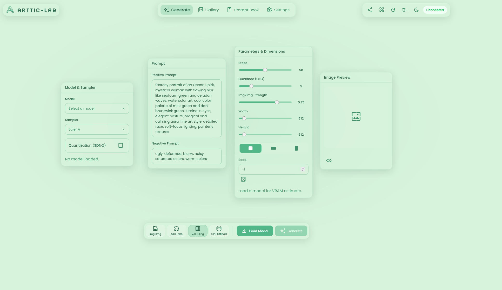
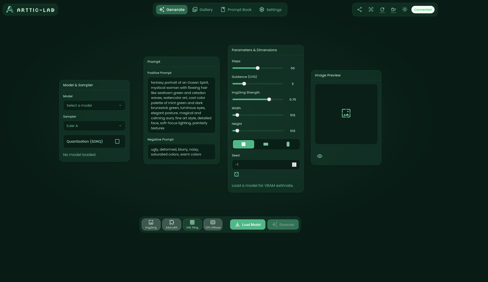

<p align="center">
  
</p>

<h2 align="center">Universal AI Art Station: Intel XPU • NVIDIA CUDA • AMD ROCm 🎨</h2>

<p align="center">
  <a href="https://opensource.org/licenses/MIT">
    
  </a>
  <a href="https://pytorch.org/">
    
  </a>
  <a href="https://www.intel.com/content/www/us/en/products/docs/arc-discrete-graphics.html">
    
  </a>
  <a href="https://github.com/Md-Siam-Mia-Man/ArtTic-LAB/stargazers">
    
  </a>
</p>

---

**ArtTic-LAB** is a hardware-agnostic, node-based generative AI platform built from the ground up for performance and aesthetics.

While originally forged for **Intel® Arc™ GPUs**, this iteration leverages **Native PyTorch** implementations to support **NVIDIA (CUDA)** and **AMD (ROCm)** with equal proficiency. It moves away from legacy wrappers (like IPEX) in favor of modern, upstream native support and the **SDNQ quantization engine** for superior memory efficiency.

Whether you are a developer scripting via the CLI or an artist using the infinite node canvas, ArtTic-LAB removes the friction between idea and image.

---

## 🧭 The Interface

ArtTic-LAB features a responsive, glassmorphic **Node-Based UI**. Unlike rigid tabbed interfaces, the infinite canvas allows you to arrange your workspace exactly how you want it.

<div align="center">
  
  
</div>

---

## 🔬 Technical Deep Dive

We’ve packed ArtTic-LAB with features designed to maximize performance on consumer hardware.

| Feature Group           | Description                                                                                                                                                                                                                                                                                                                                  |
| :---------------------- | :------------------------------------------------------------------------------------------------------------------------------------------------------------------------------------------------------------------------------------------------------------------------------------------------------------------------------------------- |
| **Universal Core ⚙️**   | **Native XPU/CUDA/ROCm:** Auto-detects hardware and utilizes native `torch.xpu`, `torch.cuda`, or `torch.hip`. No heavy external compilation required.<br>**PyTorch 2.9+ Ready:** Built on the latest nightly builds for maximum stability and speed.                                                                                        |
| **Memory Magic 💧**     | **SDNQ Integration:** Built-in support for `sdnq` quantization. Run massive models like **FLUX.1** on cards with limited VRAM (8GB/12GB) without crashing.<br>**Smart VRAM Management:** Proactive resolution limiting based on available VRAM and reactive OOM handling that auto-clears cache.                                             |
| **Pipeline Mastery 🧠** | **Auto-Architecture Detection:** Simply load a `.safetensors` file. The core logic analyzes layer keys to automatically distinguish between **SD1.5, SD2.1, SDXL, SD3, and FLUX**.<br>**Hybrid Loading:** Automatically fetches required encoder components from HuggingFace while using your local checkpoint weights.                      |
| **Modern UI/UX ✨**     | **Async Backend:** Built on **FastAPI** and **Uvicorn** with a WebSocket layer. The UI never freezes during generation.<br>**Node Canvas:** Draggable, scalable interface nodes for Prompts, Models, Parameters, and Previews.<br>**Integrated Gallery:** Seamlessly browse, zoom, and manage your creations with embedded metadata reading. |

---

## 📸 Creations Gallery

<p align="center">
  <em>All demo images generated locally using ArtTic-LAB.</em>
</p>

<div align="center" style="display: flex; flex-wrap: wrap; justify-content: center; gap: 10px;">
  
  
  
  
  
  
  
  
  
  
</div>

---

## 🚀 Installation & Usage

### 1️⃣ Prerequisites

- **Miniconda** or **Miniforge** (Python 3.10+ recommended).
- **Git** installed and available in PATH.

### 2️⃣ Quick Install

Clone the repository and run the installer script. It will create a Conda environment named `ArtTic-LAB` and auto-detect your GPU vendor to install the correct PyTorch version.

**Windows:**

```batch
install.bat
```

**Linux / macOS:**

```bash
chmod +x install.sh
./install.sh
```

### 3️⃣ Launch

Start the server and open the Web UI.

**Windows:**

```batch
start.bat
```

**Linux / macOS:**

```bash
./start.sh
```

> **Note:** Access the UI at `http://127.0.0.1:7860`. To expose a public link via Ngrok, launch with `python app.py --share`.

---

## 📂 Project Structure

```
└── 📁ArtTic-LAB
    └── 📁assets
        └── 📁demos
            ├── 1.png ... 10.png
        ├── ArtTic-LAB-CLI.png
        ├── ArtTic-LAB-GUI-Dark.png
        ├── ArtTic-LAB-GUI-Light.png
        ├── Banner.png
        ├── logo.png
    └── 📁core
        ├── __init__.py
        ├── logic.py              # Main business logic & state management
        ├── metadata_handler.py   # PNG Info reader/writer
        ├── prompt_book.py        # TOML prompt management
    └── 📁helpers
        ├── __init__.py
        ├── cli_manager.py        # Logging & System Info
    └── 📁loras
        ├── LORAS.md              # Place .safetensors LoRAs here
    └── 📁models
        ├── CyberRealisticXL.safetensors
        ├── MODELS.md             # Place Checkpoints here
    └── 📁outputs                 # Generated images saved here
    └── 📁pipelines               # Abstracted Diffusion Pipelines
        ├── __init__.py           # Pipeline selector logic
        ├── base_pipeline.py
        ├── flux_pipeline.py
        ├── sd15_pipeline.py
        ├── sd2_pipeline.py
        ├── sd3_pipeline.py
        ├── sdxl_pipeline.py
    └── 📁tests
        ├── init.py
        ├── run_tests.py
        ├── test_core.py
        ├── test_env.py
    └── 📁web
        └── 📁assets
            ├── logo.png
            └── 📁fonts
                ├── Poppins.ttf
                ├── Silkscreen.ttf
            └── 📁icons
                ├── material-symbols-outlined.woff2
                ├── material-symbols-rounded.woff2
                ├── material-symbols-sharp.woff2
        ├── __init__.py
        ├── index.html            # Main Entry Point
        ├── script.js             # Frontend Logic (WebSocket)
        ├── server.py             # FastAPI Server
        ├── style.css             # Glassmorphic Styles
    ├── .gitignore
    ├── .prettierrc
    ├── app.py                    # Launcher Script
    ├── ARC-GPU.sh                # Intel Arc Diagnostics
    ├── How_It_Works.md           # Technical Documentation
    ├── install.bat
    ├── install.ps1
    ├── install.sh
    ├── LICENSE
    ├── prompts.toml              # Prompt Database
    ├── README.md
    ├── requirements.txt
    ├── start.bat
    ├── start.ps1
    ├── start.sh
    └── test.sh
```

---

## 🤝 License

Distributed under the MIT License. See `LICENSE` for more information.
